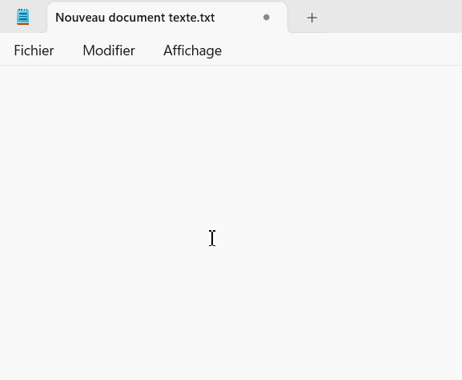
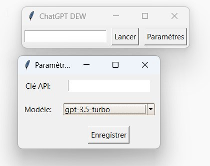

# ChatGPT-Partout
ChatGPT Partout sur votre PC

Utiliser ChatGPT n'importe où sur votre PC avec un raccourci clavier : CTRL+ALT+P

Entrer votre clé API OpenAI dans les paramètres. 






Si vous souhaitez utiliser le script python directement. Il faut installer les bibliotheques :

```

pip install tkinter ttkthemes requests keyboard pyperclip pyautogui configparser

```

Vous pouvez aussi compiller le script par vous même avec : 

```

pip install pyinstaller

```

```

pyinstaller --onefile --noconsole chatgpt.py

```

Mes liens :

Chaine youtube : https://www.youtube.com/channel/UCNFED93Cb1U6-QnrVXZlBkw

Forum : https://forumentrepreneurweb.fr/

Formation : https://devenirentrepreneurweb.fr/formations/
